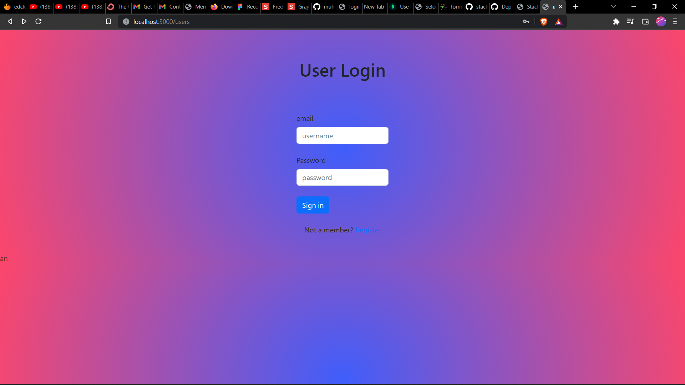

# This is a sample app where I implimented crud operation authentication and authorization
This is a web app where user can signup and Login . Admin have special features like edit userinfo delete user create user . This application was made to understand about CRUD operations and implement authentication and authorization


<br><br>
>This application is mainly developed on Back end and front-end  design needs improvemnt

## ✍ To dos
- [ ] Make better UI design

## 📱 Screenshots
 
 
 
 
 
 
 

## 💻 Test application on your machine
Open CMD from where you want to clone the project & run the following commands:
```
  git clone https://github.com/muhammed-mukthar/sample-authentication-authorization-webapp.git
```
```
 use command npm install to install all realated libarys

 go to localhost 3000

 admin :
 username: admin
 password: admin

 ```
 
## ❤ Conclusion
🌟 Star this repo & follow for more 😊